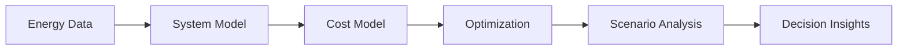

# Mohammed Eltahir

**Turning energy-system data into reproducible models and decision-ready insights.**

 

---

### Focus

  
  
  

### Toolkit

  
  
  
  
  
  
  
  
  

### Selected Work

<table>
<tr>
<td width="33%" valign="top">

#### ⚡ Energy Model

Capacity planning and energy-system scenario analysis.

[View repository →](YOUR_ENERGY_MODEL_REPOSITORY)

</td>
<td width="33%" valign="top">

#### 📊 TEA Toolkit

Reproducible cost, performance and sensitivity analysis.

[View repository →](YOUR_TEA_REPOSITORY)

</td>
<td width="33%" valign="top">

#### ∑ Optimization

Planning or operational optimization using Python.

[View repository →](YOUR_OPTIMIZATION_REPOSITORY)

</td>
</tr>
</table>

<b>Technical capabilities</b>

 

* Linear and mixed-integer optimization
* Energy-system capacity expansion
* Dispatch and operational modeling
* Techno-economic assessment
* Sensitivity and uncertainty analysis
* Scenario generation and comparison
* Data processing and visualization
* Reproducible research workflows

### GitHub Activity

**Open to energy-modeling, optimization and research collaboration.**

